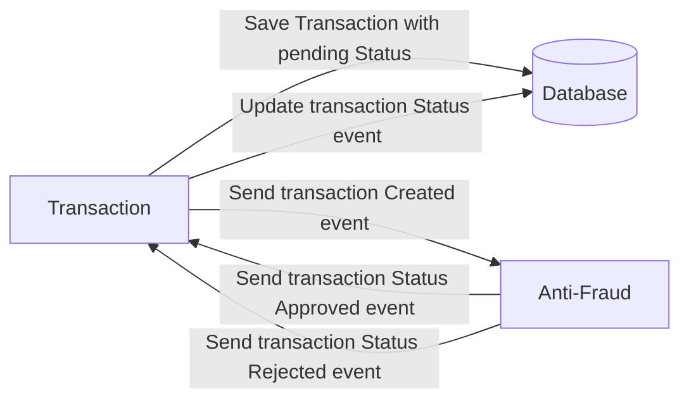

# Yape Code Challenge :rocket:

Our code challenge will let you marvel us with your Jedi coding skills :smile:.

Don't forget that the proper way to submit your work is to fork the repo and create a PR :wink: ... have fun !!

- [Problem](#problem)
- [Tech Stack](#tech_stack)
- [Send us your challenge](#send_us_your_challenge)

# Problem

Every time a financial transaction is created it must be validated by our anti-fraud microservice and then the same service sends a message back to update the transaction status.
For now, we have only three transaction statuses:

<ol>
  <li>pending</li>
  <li>approved</li>
  <li>rejected</li>
</ol>

Every transaction with a value greater than 1000 should be rejected.



# Tech Stack

<ol>
  <li>Node. You can use any framework you want (i.e. Nestjs with an ORM like TypeOrm or Prisma) </li>
  <li>Any database</li>
  <li>Kafka</li>
</ol>

We do provide a `Dockerfile` to help you get started with a dev environment.

You must have two resources:

1. Resource to create a transaction that must containt:

```json
{
  "accountExternalIdDebit": "Guid",
  "accountExternalIdCredit": "Guid",
  "tranferTypeId": 1,
  "value": 120
}
```

2. Resource to retrieve a transaction

```json
{
  "transactionExternalId": "Guid",
  "transactionType": {
    "name": ""
  },
  "transactionStatus": {
    "name": ""
  },
  "value": 120,
  "createdAt": "Date"
}
```

## Optional

You can use any approach to store transaction data but you should consider that we may deal with high volume scenarios where we have a huge amount of writes and reads for the same data at the same time. How would you tackle this requirement?

You can use Graphql;

# Send us your challenge

When you finish your challenge, after forking a repository, you **must** open a pull request to our repository. There are no limitations to the implementation, you can follow the programming paradigm, modularization, and style that you feel is the most appropriate solution.

If you have any questions, please let us know.


## 🚀 Ejecución

El sistema utiliza dos microservicios que se comunican vía Kafka. El transaction-service maneja las peticiones del cliente y la persistencia, mientras que el anti-fraud-service consume eventos para realizar validaciones de forma asíncrona, desacoplando la lógica de negocio.

**Prerrequisitos:** Docker y Docker Compose.

1.  **Clonar el repositorio:**
    ```bash
    git clone [https://github.com/paulgualambo/app-nodejs-codechallenge.git](https://github.com/paulgualambo/app-nodejs-codechallenge.git)
    cd app-nodejs-codechallenge
    ```
2.  **Levantar los servicios:**
    ```bash
    docker-compose up --build -d
    ```

3. **Creacion de BD**
    ```sql
      -- Para las funciones de UUID
      CREATE EXTENSION IF NOT EXISTS "uuid-ossp";

      -- 2. Crea la tabla de transacciones
      CREATE TABLE transactions (
          transaction_external_id UUID PRIMARY KEY DEFAULT uuid_generate_v4(),
          account_external_id_debit UUID NOT NULL,
          account_external_id_credit UUID NOT NULL,
          transfer_type_id INT NOT NULL,
          value NUMERIC(10, 2) NOT NULL,
          status VARCHAR(20) DEFAULT 'pending',
          created_at TIMESTAMP WITH TIME ZONE DEFAULT CURRENT_TIMESTAMP,
          updated_at TIMESTAMP WITH TIME ZONE DEFAULT CURRENT_TIMESTAMP
      );
    ```

4.  **Iniciar los microservicios** (si no están incluidos en Docker Compose):
    En la carpeta `transaction-service`: `yarn start:dev`
    En la carpeta `anti-fraud-service`: `yarn start:dev`

---

## ⚙️ Uso de la API

### Crear una Transacción
```bash
curl -X POST http://localhost:3000/transactions \
-H "Content-Type: application/json" \
-d '{
  "accountExternalIdDebit": "b8f4a1f0-9f1a-4b9a-8c9a-0d1e2f3a4b5c",
  "accountExternalIdCredit": "c9g5b2g1-0g2b-5c0b-9d0b-1e2f3a4b5c6d",
  "tranferTypeId": 1,
  "value": 500
}'
```

### Consulta de transaccion
```bash
curl http://localhost:3000/transactions/ID_DE_LA_TRANSACCION
```
